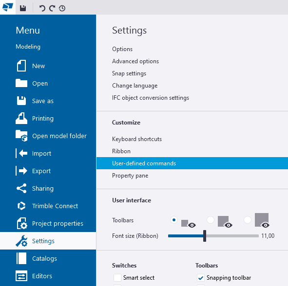
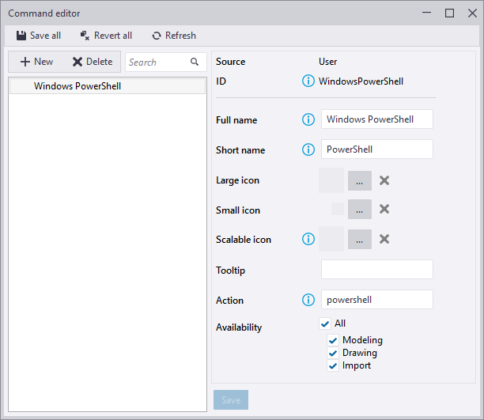
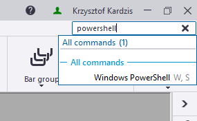
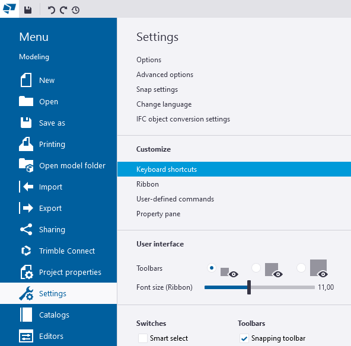
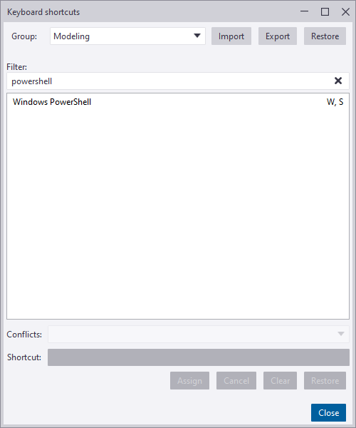

# Quick Setup

## Tekla Structures

The first step obviously is to start Tekla Structures. Any version can be used. Screenshots below were made with TS 2022.


## Settings -> User-defined commands

Open 'Command editor' to add new command to Tekla Structures.




## Command editor

Select 'New', provide 'ID', for example 'WindowsPowerShell', fill in other fields like on picture below and save. The most important field is 'Action' which is an actual 'command' to be executed.




## Quick Launch

New command can be found through 'Quick Launch' field, but a lot more convenient method will be to assign it a keyboard shortcut (see below).




## Settings -> Keyboard shortcuts

Open 'Keyboard shortcuts' editor.




## Keyboard shortcuts

Assign a keyboard shortcut to the newly created command. Good candidate would be `W,S` (two consecutive keys: W followed by S).



## Start PowerShell

From now on every time you press `W,S` (W followed by S) on your keyboard, Tekla Structures will spawn a new PowerShell session, which can be used to interact with this particular Tekla Structures instance.


# PowerShell's Execution Policy

From [<about Execution Policies - PowerShell | Microsoft Learn>](https://learn.microsoft.com/en-us/powershell/module/microsoft.powershell.core/about/about_execution_policies?view=powershell-5.1) article:
>PowerShell's execution policy is a safety feature that controls the conditions under which PowerShell loads configuration files and runs scripts. This feature helps prevent the execution of malicious scripts.
>
>...
>
>The execution policy isn't a security system that restricts user actions. For example, users can easily bypass a policy by typing the script contents at the command line when they cannot run a script. Instead, the execution policy helps users to set basic rules and prevents them from violating them unintentionally.

By default Execution Policy is set to Restricted. This permits executing individual commands from command-line, but prevents running the same commands from script files. One possible way to change this behavior is to set Execution Policy like below (one time configuration step):

``` powershell
Set-ExecutionPolicy -ExecutionPolicy RemoteSigned -Scope CurrentUser
```

As usual: be careful of malicious code. If you don't trust the script source, don't run it.
